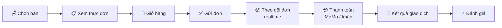

<div align="center">


# ☕ Coffee Shop User

### Giao diện khách hàng của hệ thống quản lý quán cà phê

**Chọn bàn** • **Xem thực đơn** • **Gọi món** • **Theo dõi đơn theo thời gian thực** • **Thanh toán MoMo**

<br />

[](https://react.dev/)
[](https://vitejs.dev/)
[](https://reactrouter.com/)
[](https://axios-http.com/)
[](#-công-nghệ-sử-dụng)
[](#-luồng-sử-dụng)
[](#-license)

</div>

---

## 📚 Mục lục

- [Giới thiệu](#-giới-thiệu)
- [Tính năng chính](#-tính-năng-chính)
- [Luồng sử dụng](#-luồng-sử-dụng)
- [Công nghệ sử dụng](#️-công-nghệ-sử-dụng)
- [Cấu trúc dự án](#-cấu-trúc-dự-án)
- [Bắt đầu nhanh](#-bắt-đầu-nhanh)
- [Biến môi trường](#-biến-môi-trường)
- [Quy ước code](#-quy-ước-code)
- [Hệ sinh thái dự án](#-hệ-sinh-thái-dự-án)
- [Tác giả](#-tác-giả)
- [License](#-license)

---

## 📖 Giới thiệu

**Coffee Shop User** là ứng dụng web dành cho **khách hàng** trong hệ thống quản lý quán cà phê. Khách có thể chọn bàn, khám phá thực đơn, gọi món, theo dõi tiến trình đơn hàng và thanh toán trực tuyến ngay trên trình duyệt — **không cần cài đặt ứng dụng**.

Dự án được xây dựng theo kiến trúc **feature-based**: mỗi nghiệp vụ (`table`, `menu`, `cart`, `order`, `payment`, `review`...) là một module độc lập gồm component, hook, service và style riêng, giúp dễ mở rộng, bảo trì và làm việc nhóm.

> 🔗 Đây là một trong ba thành phần của hệ thống, hoạt động cùng **Backend (Spring Boot)** và **Frontend Admin**. Xem thêm tại [Hệ sinh thái dự án](#-hệ-sinh-thái-dự-án).

---

## ✨ Tính năng chính

<table>
<tr>
<td width="50%" valign="top">

### 🪑 Chọn bàn
- Sơ đồ mặt bằng quán (`FloorMap`) và lưới bàn (`TableGrid`)
- Lọc bàn theo trạng thái, thống kê số bàn trống
- **Giữ bàn tạm thời** kèm đồng hồ đếm ngược (`useTableHolds`, `useCountdown`)

### 📋 Thực đơn tương tác
- Duyệt món theo danh mục (`CategoryTabs`)
- Tìm kiếm món có debounce (`MenuSearchBar`, `useDebounce`)
- Xem chi tiết sản phẩm qua modal (`ProductDetailModal`)
- Cập nhật thực đơn theo thời gian thực (`useMenuSocket`)

### 🛒 Giỏ hàng
- Thêm / xóa / cập nhật số lượng món
- Tự động tính tổng hóa đơn (`CartSummary`)
- Ghi chú cho đơn hàng (`OrderNotesInput`)
- Hiệu ứng ảnh bay vào giỏ + âm thanh khi thêm món

</td>
<td width="50%" valign="top">

### 📦 Theo dõi đơn hàng
- Timeline trạng thái đơn hàng qua **WebSocket** (`OrderStatusTimeline`)
- Hiển thị trạng thái kết nối (`ConnectionStatus`)
- Thông báo toast khi trạng thái thay đổi (`orderToast`)
- Các thao tác trên đơn (`OrderActionButtons`)

### 💳 Thanh toán trực tuyến
- Nhiều phương thức thanh toán (`PaymentMethods`)
- Tích hợp cổng **MoMo**, xử lý kết quả giao dịch tự động (`MomoResultPage`, `PaymentResultPage`)
- Thẻ xác nhận thanh toán thành công (`PaymentSuccessCard`)

### ⭐ Đánh giá & phản hồi
- Xem và gửi đánh giá về món, dịch vụ (`ReviewSection`, `ReviewCard`)

### 🔐 Xác thực & 📱 Responsive
- Quản lý phiên đăng nhập bằng `AuthContext`, bảo vệ route với `ProtectedRoute`
- Giao diện thích ứng desktop, tablet và di động

</td>
</tr>
</table>

---

## 🧭 Luồng sử dụng



---

## 🛠️ Công nghệ sử dụng

| Layer | Công nghệ | Ghi chú |
|:--|:--|:--|
| ⚛️ **Framework** | React 18 | Function component + Hooks |
| ⚡ **Build tool** | Vite | Dev server nhanh, HMR tức thời |
| 🧭 **Routing** | React Router DOM v6 | Khai báo tại `app/routes.jsx`, bảo vệ bằng `ProtectedRoute` |
| 🌐 **HTTP Client** | Axios | Cấu hình tại `api/axiosClient.js`, mỗi tài nguyên một file API |
| 🔄 **State toàn cục** | Context API | `AuthContext`, `CartContext` |
| 🔌 **Realtime** | WebSocket / Socket.io | Khởi tạo tại `lib/socket.js` |
| 💳 **Thanh toán** | MoMo Payment Gateway | Trang kết quả trong `features/payment` |
| 🎨 **Styling** | CSS Modules + CSS thuần | Theo từng feature / component |
| 🧹 **Code quality** | ESLint + Prettier | Đồng bộ style toàn dự án |

---

## 📁 Cấu trúc dự án

Tổ chức theo mô hình **feature-based** — mỗi tính năng là một module độc lập:

```text
coffee-shop-user/
├── public/                     🌍 Tài nguyên tĩnh (favicon, manifest, icons, sounds, videos)
├── src/
│   ├── api/                    🌐 Toàn bộ API call, dùng chung cho mọi feature
│   │   ├── axiosClient.js
│   │   ├── billApi.js
│   │   ├── categoryApi.js
│   │   ├── orderApi.js
│   │   ├── orderItemApi.js
│   │   ├── productApi.js
│   │   ├── tableApi.js
│   │   └── index.js
│   ├── app/                    🧩 App.jsx, AppProviders, ProtectedRoute, routes
│   ├── assets/                 🖼️ Ảnh, video, font, CSS tĩnh
│   ├── components/
│   │   ├── common/             ErrorBoundary, PageHeader
│   │   └── ui/                 Button, EmptyState, Loader, Modal, Toast
│   ├── constants/              ⚙️ config, orderStatus, routes
│   ├── contexts/               🔐 AuthContext
│   ├── features/               📦 Các module nghiệp vụ độc lập
│   │   ├── about/              Giới thiệu quán, đội ngũ
│   │   ├── cart/               Giỏ hàng, checkout
│   │   ├── contact/            Liên hệ
│   │   ├── home/               Trang chủ (Hero, sản phẩm mới nhất)
│   │   ├── menu/               Thực đơn, chi tiết món, đặt bàn nhanh
│   │   ├── order/              Theo dõi trạng thái đơn, thanh toán
│   │   ├── payment/            Kết quả thanh toán (MoMo)
│   │   ├── review/             Đánh giá & phản hồi
│   │   └── table/              Chọn bàn, sơ đồ, giữ bàn
│   ├── hooks/                  🪝 useAuth, useDebounce, useLocalStorage, useScrollToTop
│   ├── layouts/                🖼️ Header, Footer, Menu, MainLayout, MinimalLayout
│   ├── lib/                    🔌 socket.js
│   ├── pages/                  📄 NotFoundPage
│   ├── styles/                 🎨 global.css, reset.css, variables.css
│   ├── utils/                  🧰 formatCurrency, formatDate, storage
│   └── main.jsx                🚀 Entry point
├── .env.example
├── .prettierrc
├── eslint.config.js
├── index.html
├── jsconfig.json
├── vite.config.js
└── package.json
```

<details>
<summary><strong>📦 Cấu trúc bên trong một feature (ví dụ: <code>order</code>)</strong></summary>

<br />

```text
features/order/
├── components/          Component riêng (OrderInfoCard, OrderItemsList, PaymentMethods...)
├── hooks/               Hook riêng (useOrderSocket, useOrderStatus, usePayment...)
├── services/            Logic gọi API riêng của feature (orderTrackingService)
├── utils/               Hàm tiện ích (statusHelpers, orderToast)
├── constants.js         Hằng số của feature
├── OrderStatusPage.jsx  Trang chính
└── order.module.css     Style riêng (CSS Module)
```

Các feature khác (`cart`, `menu`, `table`, `review`...) đều theo cùng mẫu, tùy nhu cầu mà có hoặc không có `services/` và `utils/`.

</details>

<details>
<summary><strong>🔎 Chi tiết các feature chính</strong></summary>

<br />

| Feature | Thành phần nổi bật |
|:--|:--|
| 🪑 **table** | `TableSelectPage`, `FloorMap`, `TableGrid`, `TableItem`, `ConfirmBar`, `useTableHolds`, `useCountdown` |
| 📋 **menu** | `MenuPage`, `MenuOrderPage`, `CategoryTabs`, `ProductCard`, `ProductDetailModal`, `useProducts`, `useMenuSocket`, `flyingImage` |
| 🛒 **cart** | `CartPage`, `CartContext`, `CartItem`, `CartSummary`, `useCart`, `useCheckout`, `orderService` |
| 📦 **order** | `OrderStatusPage`, `OrderStatusTimeline`, `useOrderSocket`, `usePayment`, `orderTrackingService` |
| 💳 **payment** | `MomoResultPage`, `PaymentResultPage` |
| ⭐ **review** | `ReviewSection`, `ReviewCard` |

</details>

---

## 🚀 Bắt đầu nhanh

### Yêu cầu

- **Node.js** 18+ và **npm**
- Backend (`cafe`) đang chạy để ứng dụng có dữ liệu

### Cài đặt & chạy

```bash
# 1️⃣ Cài đặt dependencies
npm install

# 2️⃣ Tạo file .env từ mẫu
cp .env.example .env

# 3️⃣ Chạy môi trường development
npm run dev

# 4️⃣ Build production
npm run build

# 5️⃣ Xem trước bản build
npm run preview
```

> 💡 Sau khi chạy `npm run dev`, ứng dụng khả dụng tại `http://localhost:5173` (mặc định của Vite).

---

## 🔐 Biến môi trường

Sao chép `.env.example` thành `.env` rồi cấu hình các biến cần thiết trước khi chạy:

| Nhóm | Mô tả |
|:--|:--|
| 🌐 **API** | URL của Backend (Spring Boot) |
| 🔌 **Socket** | Địa chỉ WebSocket cho cập nhật realtime |
| 💳 **MoMo** | Cấu hình liên quan đến cổng thanh toán MoMo |

> ⚠️ Không commit file `.env` lên Git. Chỉ commit `.env.example`.

---

## 📏 Quy ước code

- **Định dạng**: tự động bằng **Prettier** (`.prettierrc`)
- **Kiểm tra lỗi**: **ESLint** (`eslint.config.js`)
- **Đặt tên**: component theo `PascalCase`, hook theo `useXxx`
- **Style**: dùng **CSS Modules** cho từng feature, hạn chế style toàn cục ngoài `styles/`
- **API**: mọi lời gọi HTTP tập trung tại `src/api/`, không gọi Axios trực tiếp trong component
- **Kiến trúc**: code riêng của nghiệp vụ nằm trong `features/<tên>/`, code dùng chung mới đưa ra `components/`, `hooks/`, `utils/`

---

## 🔗 Hệ sinh thái dự án

| Thành phần | Vai trò | Công nghệ |
|:--|:--|:--|
| 🖥️ **Backend** (`cafe`) | API, xử lý nghiệp vụ, thanh toán | Spring Boot, MySQL, JWT, WebSocket |
| 🛠️ **Frontend (Admin)** | Dành cho quản trị viên & nhân viên | React + Vite, Material Tailwind |
| 👥 **Frontend (User)** *(dự án này)* | Dành cho khách hàng đặt món | React + Vite |

---

## 👤 Tác giả

**Hoàng Phùng Thanh Đạt** *(Hoàng Đạt Coder)*

[](mailto:dat147714@gmail.com)
[](https://github.com/HoangPhungThanhDat)

---

## 📄 License

Dự án phục vụ mục đích học tập / nội bộ. Vui lòng liên hệ tác giả trước khi sử dụng cho mục đích thương mại.

<div align="center">

Made with ☕ and 💻 by **Hoàng Đạt DEV**

</div>